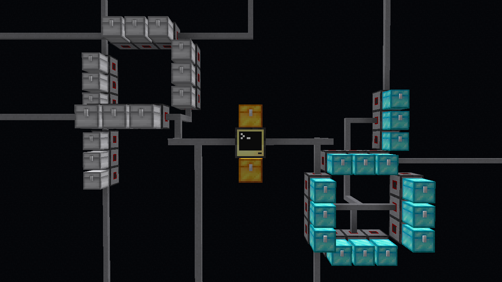

# Pipe : Dream



## Description

Pipe Dream is a program that allows you to create virtual "pipes" between
inventories in Minecraft. Setting up a pipe is very simple, and the computer
will take care of moving items between the inventories for you.

## Installation

To install Pipe Dream, simply run the following command in the ComputerCraft
Shell:

```
wget run https://raw.githubusercontent.com/Fatboychummy-CC/pipe-dream/main/installer.lua
```

Follow the instructions on the screen to complete the installation.

## Usage

Pipe Dream is a GUI-based program, but all inputs are done using the keyboard.
Controls for each section are usually at the top of the page, but for the most
part you can use backspace to go back, enter to confirm, and the arrow keys to
navigate.

See the [wiki](https://github.com/Fatboychummy-CC/pipe-dream/wiki) for more
information on how to use Pipe Dream.

## License

Pipe Dream is licensed under the MIT License. See the [LICENSE](LICENSE) file
for more information.

## Contributing

If you would like to contribute to Pipe Dream, please fork the repository and
submit a pull request, or just make an issue if you have a suggestion/bug to
report.

## Credits

- Pipe Dream was created by me (Fatboychummy).

- [PrimeUI](https://github.com/MCJack123/PrimeUI) was created by
[@MCJack123](https://github.com/MCJack123), and is licensed under
[CC0](https://github.com/MCJack123/PrimeUI?tab=readme-ov-file#license). PrimeUI
has been slightly modified for use with this program.

- `file_helper.lua`, `logging.lua`, and `thready.lua` are created by me, and are
licensed under
[The Unlicense](https://github.com/Fatboychummy-CC/Libraries/blob/main/LICENSE).
They can be found on my [Libraries](https://github.com/Fatboychummy-CC/Libraries)
repository, along with several other libraries.

- `installer.lua` is created by me, and is licensed under
[The Unlicense](https://github.com/Fatboychummy-CC/etc-programs/blob/main/LICENSE).
It can be found on my [etc-programs](https://github.com/Fatboychummy-CC/etc-programs)
repository, along with several other programs.